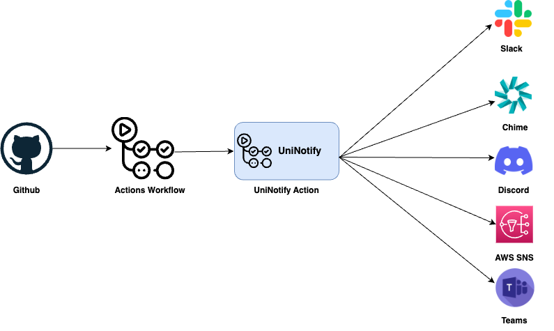

<p>
  <a href="https://github.com/actions/typescript-action/actions"></a>
</p>

# UniNotify GitHub Action

This GitHub action allows for easy integration of GitHub actions with various communication platforms such as Slack, Discord, Microsoft Teams, Chime, and AWS SNS for notification purposes.



## Services

Following are the services currently integrated to this action. 

### Slack

This service allows you to send custom messages to a specified Slack channel whenever a GitHub action is triggered.

**Required parameters**:
```yml
githubToken: ${{ secrets.GITHUB_TOKEN }}
messageType: 'slack' 
slackToken: ${{ secrets.SLACK_API_TOKEN }}
```

### Discord
The Discord service enables you to send custom messages to a specified Discord channel when a GitHub action runs.

**Required parameters**:
```yml
githubToken: ${{ secrets.GITHUB_TOKEN }}
messageType: 'discord'
discordWebhookUrl: ${{ secrets.DISCORD_WEBHOOK_URL }}
```

### Chime
The Chime service permits sending custom messages to a specified Chime chat room when a GitHub action occurs.

**Required parameters**:
```yml
githubToken: ${{ secrets.GITHUB_TOKEN }}
messageType: 'chime'
chimeWebhookUrl: ${{ secrets.CHIME_WEBHOOK_URL }}
```

### AWS SNS
The AWS SNS service provides the ability to publish custom messages to an SNS topic when a GitHub action gets triggered. These messages can be received through any endpoint subscribed to the topic, such as email or SMS.

**Required parameters**:
```yml
messageType: 'sns'
githubToken: ${{ secrets.GITHUB_TOKEN }}
awsAccessKeyId: ${{ secrets.AWS_ACCESS_KEY_ID }}
awsSecretAccessKey: ${{ secrets.AWS_SECRET_ACCESS_KEY }}
snsTopicArn: ${{ secrets.AWS_SNS_TOPIC_ARN }}
awsRegion: 'us-east-1'
```

### Usage
To use this GitHub action, you need to set the necessary environment variables in your workflow file (*.yml), and then call the action.

An example workflow file would look something like this:

```yml
name: 'build-test'
on: # rebuild any PRs and main branch changes
  pull_request:
  push:
    branches:
      - main
      - 'releases/*'
      
jobs:
  notify:
    runs-on: ubuntu-latest
    steps:
    - name: Send Notification to slack
      uses: OSCloudysky/UniNotify@v1
      with:
        githubToken: ${{ secrets.GITHUB_TOKEN }}
        messageType: 'slack' 
        slackToken: ${{ secrets.SLACK_API_TOKEN }}
```


## License
This project is licensed under the MIT License. See the LICENSE file for more details.

## Contributing
Please see CONTRIBUTING and CODE_OF_CONDUCT for details.

In essence, we would love you to contribute to UniNotify, and we want to make it as easy and transparent as possible, whether it's:

- Reporting an issue
- Discussing the current state of the code
- Submitting a fix
- Proposing new features

## Security Vulnerabilities
  
If you discover a security vulnerability within this package, please create an issue against this repo. All security vulnerabilities will be promptly addressed.

